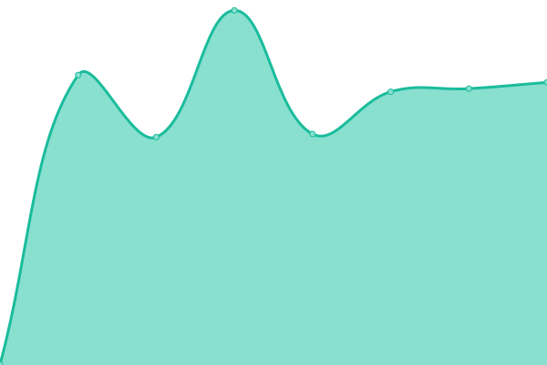
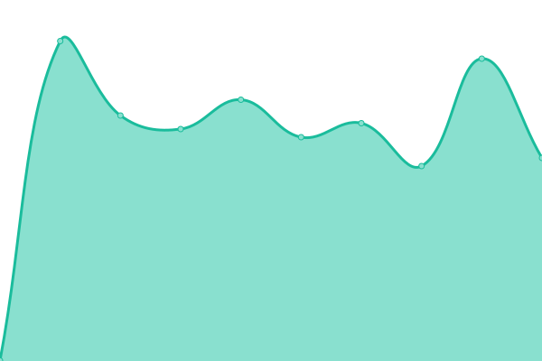
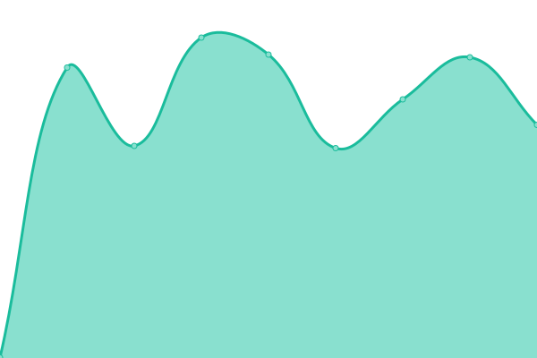
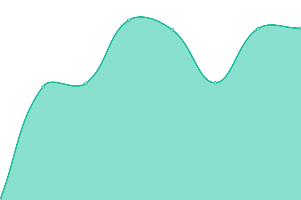

# [📈 Live Status](https://503stack.xyz/uptimeprod): <!--live status--> **🟧 Partial outage**

This repository contains the open-source uptime monitor and status page for [503stack](https://503stack.xyz/uptimeprod), powered by [Upptime](https://github.com/upptime/upptime).

With [Upptime](https://upptime.js.org), you can get your own unlimited and free uptime monitor and status page, powered entirely by a GitHub repository. We use [Issues](https://github.com/503stack/uptimeprod/issues) as incident reports, [Actions](https://github.com/503stack/uptimeprod/actions) as uptime monitors, and [Pages](https://503stack.xyz/uptimeprod) for the status page.

<!--start: status pages-->
<!-- This summary is generated by Upptime (https://github.com/upptime/upptime) -->
<!-- Do not edit this manually, your changes will be overwritten -->
<!-- prettier-ignore -->
| URL | Status | History | Response Time | Uptime |
| --- | ------ | ------- | ------------- | ------ |
|  [brg-prod-aks](https://brg.apps.altinn.no/kuberneteswrapper/api/v1/deployments) | 🟩 Up | [brg-prod-aks.yml](https://github.com/503stack/uptimeprod/commits/HEAD/history/brg-prod-aks.yml) | 

 790ms
     
 | 

<a href="https://503stack.xyz/history/brg-prod-aks">100.00%</a>
    

|  [dat-prod-aks](https://dat.apps.altinn.no/kuberneteswrapper/api/v1/deployments) | 🟩 Up | [dat-prod-aks.yml](https://github.com/503stack/uptimeprod/commits/HEAD/history/dat-prod-aks.yml) | 

 746ms
     
 | 

<a href="https://503stack.xyz/history/dat-prod-aks">100.00%</a>
    

|  [dibk-prod-aks](https://dibk.apps.altinn.no/kuberneteswrapper/api/v1/deployments) | 🟩 Up | [dibk-prod-aks.yml](https://github.com/503stack/uptimeprod/commits/HEAD/history/dibk-prod-aks.yml) | 

 747ms
     
 | 

<a href="https://503stack.xyz/history/dibk-prod-aks">100.00%</a>
    

|  [digdir-prod-aks](https://digdir.apps.altinn.no/kuberneteswrapper/api/v1/deployments) | 🟩 Up | [digdir-prod-aks.yml](https://github.com/503stack/uptimeprod/commits/HEAD/history/digdir-prod-aks.yml) | 

 615ms
     
 | 

<a href="https://503stack.xyz/history/digdir-prod-aks">100.00%</a>
    

|  [dihe-prod-aks](https://dihe.apps.altinn.no/kuberneteswrapper/api/v1/deployments) | 🟩 Up | [dihe-prod-aks.yml](https://github.com/503stack/uptimeprod/commits/HEAD/history/dihe-prod-aks.yml) | 

 735ms
     
 | 

<a href="https://503stack.xyz/history/dihe-prod-aks">100.00%</a>
    

|  [dmf-prod-aks](https://dmf.apps.altinn.no/kuberneteswrapper/api/v1/deployments) | 🟩 Up | [dmf-prod-aks.yml](https://github.com/503stack/uptimeprod/commits/HEAD/history/dmf-prod-aks.yml) | 

 651ms
     
 | 

<a href="https://503stack.xyz/history/dmf-prod-aks">100.00%</a>
    

|  [din-prod-aks](https://din.apps.altinn.no/kuberneteswrapper/api/v1/deployments) | 🟩 Up | [din-prod-aks.yml](https://github.com/503stack/uptimeprod/commits/HEAD/history/din-prod-aks.yml) | 

 755ms
     
 | 

<a href="https://503stack.xyz/history/din-prod-aks">100.00%</a>
    

|  [dsb-prod-aks](https://dsb.apps.altinn.no/kuberneteswrapper/api/v1/deployments) | 🟩 Up | [dsb-prod-aks.yml](https://github.com/503stack/uptimeprod/commits/HEAD/history/dsb-prod-aks.yml) | 

 696ms
     
 | 

<a href="https://503stack.xyz/history/dsb-prod-aks">100.00%</a>
    

|  [fd-prod-aks](https://fd.apps.altinn.no/kuberneteswrapper/api/v1/deployments) | 🟩 Up | [fd-prod-aks.yml](https://github.com/503stack/uptimeprod/commits/HEAD/history/fd-prod-aks.yml) | 

 607ms
     
 | 

<a href="https://503stack.xyz/history/fd-prod-aks">100.00%</a>
    

|  [fhi-prod-aks](https://fhi.apps.altinn.no/kuberneteswrapper/api/v1/deployments) | 🟩 Up | [fhi-prod-aks.yml](https://github.com/503stack/uptimeprod/commits/HEAD/history/fhi-prod-aks.yml) | 

 624ms
     
 | 

<a href="https://503stack.xyz/history/fhi-prod-aks">100.00%</a>
    

|  [fors-prod-aks](https://fors.apps.altinn.no/kuberneteswrapper/api/v1/deployments) | 🟩 Up | [fors-prod-aks.yml](https://github.com/503stack/uptimeprod/commits/HEAD/history/fors-prod-aks.yml) | 

 636ms
     
 | 

<a href="https://503stack.xyz/history/fors-prod-aks">100.00%</a>
    

|  [gk-prod-aks](https://gk.apps.altinn.no/kuberneteswrapper/api/v1/deployments) | 🟩 Up | [gk-prod-aks.yml](https://github.com/503stack/uptimeprod/commits/HEAD/history/gk-prod-aks.yml) | 

 603ms
     
 | 

<a href="https://503stack.xyz/history/gk-prod-aks">100.00%</a>
    

|  [hdir-prod-aks](https://hdir.apps.altinn.no/kuberneteswrapper/api/v1/deployments) | 🟩 Up | [hdir-prod-aks.yml](https://github.com/503stack/uptimeprod/commits/HEAD/history/hdir-prod-aks.yml) | 

 597ms
     
 | 

<a href="https://503stack.xyz/history/hdir-prod-aks">100.00%</a>
    

|  [hemit-prod-aks](https://hemit.apps.altinn.no/kuberneteswrapper/api/v1/deployments) | 🟩 Up | [hemit-prod-aks.yml](https://github.com/503stack/uptimeprod/commits/HEAD/history/hemit-prod-aks.yml) | 

 597ms
     
 | 

<a href="https://503stack.xyz/history/hemit-prod-aks">100.00%</a>
    

|  [hi-prod-aks](https://hi.apps.altinn.no/kuberneteswrapper/api/v1/deployments) | 🟩 Up | [hi-prod-aks.yml](https://github.com/503stack/uptimeprod/commits/HEAD/history/hi-prod-aks.yml) | 

 607ms
     
 | 

<a href="https://503stack.xyz/history/hi-prod-aks">100.00%</a>
    

|  [hmrhf-prod-aks](https://hmrhf.apps.altinn.no/kuberneteswrapper/api/v1/deployments) | 🟥 Down | [hmrhf-prod-aks.yml](https://github.com/503stack/uptimeprod/commits/HEAD/history/hmrhf-prod-aks.yml) | 

 0ms
     
 | 

<a href="https://503stack.xyz/history/hmrhf-prod-aks">0.00%</a>
    

|  [ikta-prod-aks](https://ikta.apps.altinn.no/kuberneteswrapper/api/v1/deployments) | 🟩 Up | [ikta-prod-aks.yml](https://github.com/503stack/uptimeprod/commits/HEAD/history/ikta-prod-aks.yml) | 

 641ms
     
 | 

<a href="https://503stack.xyz/history/ikta-prod-aks">100.00%</a>
    

|  [krt-prod-aks](https://krt.apps.altinn.no/kuberneteswrapper/api/v1/deployments) | 🟩 Up | [krt-prod-aks.yml](https://github.com/503stack/uptimeprod/commits/HEAD/history/krt-prod-aks.yml) | 

 600ms
     
 | 

<a href="https://503stack.xyz/history/krt-prod-aks">100.00%</a>
    

|  [kv-prod-aks](https://kv.apps.altinn.no/kuberneteswrapper/api/v1/deployments) | 🟩 Up | [kv-prod-aks.yml](https://github.com/503stack/uptimeprod/commits/HEAD/history/kv-prod-aks.yml) | 

 563ms
     
 | 

<a href="https://503stack.xyz/history/kv-prod-aks">100.00%</a>
    

|  [kyv-prod-aks](https://kyv.apps.altinn.no/kuberneteswrapper/api/v1/deployments) | 🟩 Up | [kyv-prod-aks.yml](https://github.com/503stack/uptimeprod/commits/HEAD/history/kyv-prod-aks.yml) | 

 615ms
     
 | 

<a href="https://503stack.xyz/history/kyv-prod-aks">100.00%</a>
    

|  [lt-prod-aks](https://lt.apps.altinn.no/kuberneteswrapper/api/v1/deployments) | 🟩 Up | [lt-prod-aks.yml](https://github.com/503stack/uptimeprod/commits/HEAD/history/lt-prod-aks.yml) | 

 588ms
     
 | 

<a href="https://503stack.xyz/history/lt-prod-aks">100.00%</a>
    

|  [mat-prod-aks](https://mat.apps.altinn.no/kuberneteswrapper/api/v1/deployments) | 🟩 Up | [mat-prod-aks.yml](https://github.com/503stack/uptimeprod/commits/HEAD/history/mat-prod-aks.yml) | 

 581ms
     
 | 

<a href="https://503stack.xyz/history/mat-prod-aks">100.00%</a>
    

|  [nb-prod-aks](https://nb.apps.altinn.no/kuberneteswrapper/api/v1/deployments) | 🟩 Up | [nb-prod-aks.yml](https://github.com/503stack/uptimeprod/commits/HEAD/history/nb-prod-aks.yml) | 

 574ms
     
 | 

<a href="https://503stack.xyz/history/nb-prod-aks">100.00%</a>
    

|  [nbib-prod-aks](https://nbib.apps.altinn.no/kuberneteswrapper/api/v1/deployments) | 🟩 Up | [nbib-prod-aks.yml](https://github.com/503stack/uptimeprod/commits/HEAD/history/nbib-prod-aks.yml) | 

 556ms
     
 | 

<a href="https://503stack.xyz/history/nbib-prod-aks">100.00%</a>
    

|  [nhn-prod-aks](https://nhn.apps.altinn.no/kuberneteswrapper/api/v1/deployments) | 🟩 Up | [nhn-prod-aks.yml](https://github.com/503stack/uptimeprod/commits/HEAD/history/nhn-prod-aks.yml) | 

 636ms
     
 | 

<a href="https://503stack.xyz/history/nhn-prod-aks">100.00%</a>
    

|  [nkom-prod-aks](https://nkom.apps.altinn.no/kuberneteswrapper/api/v1/deployments) | 🟩 Up | [nkom-prod-aks.yml](https://github.com/503stack/uptimeprod/commits/HEAD/history/nkom-prod-aks.yml) | 

 562ms
     
 | 

<a href="https://503stack.xyz/history/nkom-prod-aks">100.00%</a>
    

|  [oed-prod-aks](https://oed.apps.altinn.no/kuberneteswrapper/api/v1/deployments) | 🟩 Up | [oed-prod-aks.yml](https://github.com/503stack/uptimeprod/commits/HEAD/history/oed-prod-aks.yml) | 

 584ms
     
 | 

<a href="https://503stack.xyz/history/oed-prod-aks">100.00%</a>
    

|  [pat-prod-aks](https://pat.apps.altinn.no/kuberneteswrapper/api/v1/deployments) | 🟩 Up | [pat-prod-aks.yml](https://github.com/503stack/uptimeprod/commits/HEAD/history/pat-prod-aks.yml) | 

 661ms
     
 | 

<a href="https://503stack.xyz/history/pat-prod-aks">100.00%</a>
    

|  [sfvt-prod-aks](https://sfvt.apps.altinn.no/kuberneteswrapper/api/v1/deployments) | 🟩 Up | [sfvt-prod-aks.yml](https://github.com/503stack/uptimeprod/commits/HEAD/history/sfvt-prod-aks.yml) | 

 588ms
     
 | 

<a href="https://503stack.xyz/history/sfvt-prod-aks">100.00%</a>
    

|  [skd-prod-aks](https://skd.apps.altinn.no/kuberneteswrapper/api/v1/deployments) | 🟩 Up | [skd-prod-aks.yml](https://github.com/503stack/uptimeprod/commits/HEAD/history/skd-prod-aks.yml) | 

 559ms
     
 | 

<a href="https://503stack.xyz/history/skd-prod-aks">100.00%</a>
    

|  [srf-prod-aks](https://srf.apps.altinn.no/kuberneteswrapper/api/v1/deployments) | 🟩 Up | [srf-prod-aks.yml](https://github.com/503stack/uptimeprod/commits/HEAD/history/srf-prod-aks.yml) | 

 575ms
     
 | 

<a href="https://503stack.xyz/history/srf-prod-aks">100.00%</a>
    

|  [ssb-prod-aks](https://ssb.apps.altinn.no/kuberneteswrapper/api/v1/deployments) | 🟩 Up | [ssb-prod-aks.yml](https://github.com/503stack/uptimeprod/commits/HEAD/history/ssb-prod-aks.yml) | 

 592ms
     
 | 

<a href="https://503stack.xyz/history/ssb-prod-aks">100.00%</a>
    

|  [staf-prod-aks](https://staf.apps.altinn.no/kuberneteswrapper/api/v1/deployments) | 🟩 Up | [staf-prod-aks.yml](https://github.com/503stack/uptimeprod/commits/HEAD/history/staf-prod-aks.yml) | 

 596ms
     
 | 

<a href="https://503stack.xyz/history/staf-prod-aks">100.00%</a>
    

|  [stami-prod-aks](https://stami.apps.altinn.no/kuberneteswrapper/api/v1/deployments) | 🟩 Up | [stami-prod-aks.yml](https://github.com/503stack/uptimeprod/commits/HEAD/history/stami-prod-aks.yml) | 

 577ms
     
 | 

<a href="https://503stack.xyz/history/stami-prod-aks">100.00%</a>
    

|  [svv-prod-aks](https://svv.apps.altinn.no/kuberneteswrapper/api/v1/deployments) | 🟩 Up | [svv-prod-aks.yml](https://github.com/503stack/uptimeprod/commits/HEAD/history/svv-prod-aks.yml) | 

 579ms
     
 | 

<a href="https://503stack.xyz/history/svv-prod-aks">100.00%</a>
    

|  [tad-prod-aks](https://tad.apps.altinn.no/kuberneteswrapper/api/v1/deployments) | 🟩 Up | [tad-prod-aks.yml](https://github.com/503stack/uptimeprod/commits/HEAD/history/tad-prod-aks.yml) | 

 596ms
     
 | 

<a href="https://503stack.xyz/history/tad-prod-aks">100.00%</a>
    

|  [tra-prod-aks](https://tra.apps.altinn.no/kuberneteswrapper/api/v1/deployments) | 🟩 Up | [tra-prod-aks.yml](https://github.com/503stack/uptimeprod/commits/HEAD/history/tra-prod-aks.yml) | 

 603ms
     
 | 

<a href="https://503stack.xyz/history/tra-prod-aks">100.00%</a>
    

|  [ttd-prod-aks](https://ttd.apps.altinn.no/kuberneteswrapper/api/v1/deployments) | 🟩 Up | [ttd-prod-aks.yml](https://github.com/503stack/uptimeprod/commits/HEAD/history/ttd-prod-aks.yml) | 

 567ms
     
 | 

<a href="https://503stack.xyz/history/ttd-prod-aks">100.00%</a>
    

|  [udi-prod-aks](https://udi.apps.altinn.no/kuberneteswrapper/api/v1/deployments) | 🟩 Up | [udi-prod-aks.yml](https://github.com/503stack/uptimeprod/commits/HEAD/history/udi-prod-aks.yml) | 

 565ms
     
 | 

<a href="https://503stack.xyz/history/udi-prod-aks">100.00%</a>
    

|  [udir-prod-aks](https://udir.apps.altinn.no/kuberneteswrapper/api/v1/deployments) | 🟩 Up | [udir-prod-aks.yml](https://github.com/503stack/uptimeprod/commits/HEAD/history/udir-prod-aks.yml) | 

 562ms
     
 | 

<a href="https://503stack.xyz/history/udir-prod-aks">100.00%</a>
    

|  [valg-prod-aks](https://valg.apps.altinn.no/kuberneteswrapper/api/v1/deployments) | 🟩 Up | [valg-prod-aks.yml](https://github.com/503stack/uptimeprod/commits/HEAD/history/valg-prod-aks.yml) | 

 583ms
     
 | 

<a href="https://503stack.xyz/history/valg-prod-aks">100.00%</a>
    

<!--end: status pages-->

[**Visit our status website →**](https://503stack.xyz/uptimeprod)

## 📄 License

- Powered by: [Upptime](https://github.com/upptime/upptime)
- Code: [MIT](./LICENSE) © [Anand Chowdhary](https://anandchowdhary.com), supported by [Pabio](https://pabio.com)
- Data in the `./history` directory: [Open Database License](https://opendatacommons.org/licenses/odbl/1-0/)
