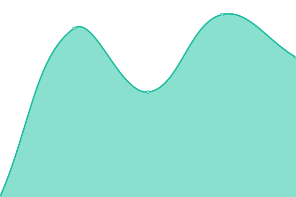
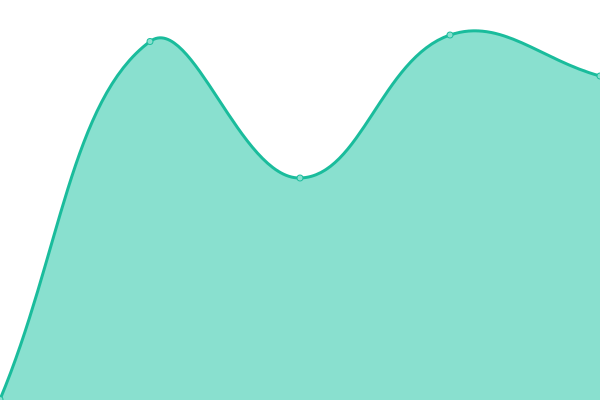
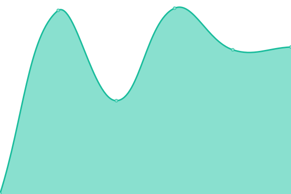

# [📈 Live Status](https://503stack.xyz/uptimeprod): <!--live status--> **🟩 All systems operational**

This repository contains the open-source uptime monitor and status page for [503stack](https://503stack.xyz/uptimeprod), powered by [Upptime](https://github.com/upptime/upptime).

With [Upptime](https://upptime.js.org), you can get your own unlimited and free uptime monitor and status page, powered entirely by a GitHub repository. We use [Issues](https://github.com/503stack/uptimeprod/issues) as incident reports, [Actions](https://github.com/503stack/uptimeprod/actions) as uptime monitors, and [Pages](https://503stack.xyz/uptimeprod) for the status page.

<!--start: status pages-->
<!-- This summary is generated by Upptime (https://github.com/upptime/upptime) -->
<!-- Do not edit this manually, your changes will be overwritten -->
<!-- prettier-ignore -->
| URL | Status | History | Response Time | Uptime |
| --- | ------ | ------- | ------------- | ------ |
|  [brg](https://brg.apps.altinn.no/kuberneteswrapper/api/v1/deployments) | 🟩 Up | [brg.yml](https://github.com/503stack/uptimeprod/commits/HEAD/history/brg.yml) | 

 797ms
     
 | 

<a href="https://503stack.xyz/uptimeprod/history/brg">100.00%</a>
    

|  [dat](https://dat.apps.altinn.no/kuberneteswrapper/api/v1/deployments) | 🟩 Up | [dat.yml](https://github.com/503stack/uptimeprod/commits/HEAD/history/dat.yml) | 

 733ms
     
 | 

<a href="https://503stack.xyz/uptimeprod/history/dat">100.00%</a>
    

|  [dibk](https://dibk.apps.altinn.no/kuberneteswrapper/api/v1/deployments) | 🟩 Up | [dibk.yml](https://github.com/503stack/uptimeprod/commits/HEAD/history/dibk.yml) | 

 716ms
     
 | 

<a href="https://503stack.xyz/uptimeprod/history/dibk">100.00%</a>
    

|  [digdir](https://digdir.apps.altinn.no/kuberneteswrapper/api/v1/deployments) | 🟩 Up | [digdir.yml](https://github.com/503stack/uptimeprod/commits/HEAD/history/digdir.yml) | 

 756ms
     
 | 

<a href="https://503stack.xyz/uptimeprod/history/digdir">100.00%</a>
    

|  [dihe](https://dihe.apps.altinn.no/kuberneteswrapper/api/v1/deployments) | 🟩 Up | [dihe.yml](https://github.com/503stack/uptimeprod/commits/HEAD/history/dihe.yml) | 

 689ms
     
 | 

<a href="https://503stack.xyz/uptimeprod/history/dihe">100.00%</a>
    

|  [dmf](https://dmf.apps.altinn.no/kuberneteswrapper/api/v1/deployments) | 🟩 Up | [dmf.yml](https://github.com/503stack/uptimeprod/commits/HEAD/history/dmf.yml) | 

 657ms
     
 | 

<a href="https://503stack.xyz/uptimeprod/history/dmf">100.00%</a>
    

|  [din](https://din.apps.altinn.no/kuberneteswrapper/api/v1/deployments) | 🟩 Up | [din.yml](https://github.com/503stack/uptimeprod/commits/HEAD/history/din.yml) | 

 708ms
     
 | 

<a href="https://503stack.xyz/uptimeprod/history/din">100.00%</a>
    

|  [dsb](https://dsb.apps.altinn.no/kuberneteswrapper/api/v1/deployments) | 🟩 Up | [dsb.yml](https://github.com/503stack/uptimeprod/commits/HEAD/history/dsb.yml) | 

 694ms
     
 | 

<a href="https://503stack.xyz/uptimeprod/history/dsb">100.00%</a>
    

|  [fd](https://fd.apps.altinn.no/kuberneteswrapper/api/v1/deployments) | 🟩 Up | [fd.yml](https://github.com/503stack/uptimeprod/commits/HEAD/history/fd.yml) | 

 641ms
     
 | 

<a href="https://503stack.xyz/uptimeprod/history/fd">100.00%</a>
    

|  [fhi](https://fhi.apps.altinn.no/kuberneteswrapper/api/v1/deployments) | 🟩 Up | [fhi.yml](https://github.com/503stack/uptimeprod/commits/HEAD/history/fhi.yml) | 

 608ms
     
 | 

<a href="https://503stack.xyz/uptimeprod/history/fhi">100.00%</a>
    

|  [fors](https://fors.apps.altinn.no/kuberneteswrapper/api/v1/deployments) | 🟩 Up | [fors.yml](https://github.com/503stack/uptimeprod/commits/HEAD/history/fors.yml) | 

 667ms
     
 | 

<a href="https://503stack.xyz/uptimeprod/history/fors">100.00%</a>
    

|  [gk](https://gk.apps.altinn.no/kuberneteswrapper/api/v1/deployments) | 🟩 Up | [gk.yml](https://github.com/503stack/uptimeprod/commits/HEAD/history/gk.yml) | 

 621ms
     
 | 

<a href="https://503stack.xyz/uptimeprod/history/gk">100.00%</a>
    

|  [hdir](https://hdir.apps.altinn.no/kuberneteswrapper/api/v1/deployments) | 🟩 Up | [hdir.yml](https://github.com/503stack/uptimeprod/commits/HEAD/history/hdir.yml) | 

 626ms
     
 | 

<a href="https://503stack.xyz/uptimeprod/history/hdir">100.00%</a>
    

|  [hemit](https://hemit.apps.altinn.no/kuberneteswrapper/api/v1/deployments) | 🟩 Up | [hemit.yml](https://github.com/503stack/uptimeprod/commits/HEAD/history/hemit.yml) | 

 726ms
     
 | 

<a href="https://503stack.xyz/uptimeprod/history/hemit">100.00%</a>
    

|  [hi](https://hi.apps.altinn.no/kuberneteswrapper/api/v1/deployments) | 🟩 Up | [hi.yml](https://github.com/503stack/uptimeprod/commits/HEAD/history/hi.yml) | 

 652ms
     
 | 

<a href="https://503stack.xyz/uptimeprod/history/hi">100.00%</a>
    

|  [hmrhf](https://hmrhf.apps.altinn.no/kuberneteswrapper/api/v1/deployments) | 🟩 Up | [hmrhf.yml](https://github.com/503stack/uptimeprod/commits/HEAD/history/hmrhf.yml) | 

 617ms
     
 | 

<a href="https://503stack.xyz/uptimeprod/history/hmrhf">100.00%</a>
    

|  [ikta](https://ikta.apps.altinn.no/kuberneteswrapper/api/v1/deployments) | 🟩 Up | [ikta.yml](https://github.com/503stack/uptimeprod/commits/HEAD/history/ikta.yml) | 

 627ms
     
 | 

<a href="https://503stack.xyz/uptimeprod/history/ikta">100.00%</a>
    

|  [krt](https://krt.apps.altinn.no/kuberneteswrapper/api/v1/deployments) | 🟩 Up | [krt.yml](https://github.com/503stack/uptimeprod/commits/HEAD/history/krt.yml) | 

 668ms
     
 | 

<a href="https://503stack.xyz/uptimeprod/history/krt">100.00%</a>
    

|  [kv](https://kv.apps.altinn.no/kuberneteswrapper/api/v1/deployments) | 🟩 Up | [kv.yml](https://github.com/503stack/uptimeprod/commits/HEAD/history/kv.yml) | 

 645ms
     
 | 

<a href="https://503stack.xyz/uptimeprod/history/kv">100.00%</a>
    

|  [kyv](https://kyv.apps.altinn.no/kuberneteswrapper/api/v1/deployments) | 🟩 Up | [kyv.yml](https://github.com/503stack/uptimeprod/commits/HEAD/history/kyv.yml) | 

 639ms
     
 | 

<a href="https://503stack.xyz/uptimeprod/history/kyv">100.00%</a>
    

|  [lt](https://lt.apps.altinn.no/kuberneteswrapper/api/v1/deployments) | 🟩 Up | [lt.yml](https://github.com/503stack/uptimeprod/commits/HEAD/history/lt.yml) | 

 635ms
     
 | 

<a href="https://503stack.xyz/uptimeprod/history/lt">100.00%</a>
    

|  [mat](https://mat.apps.altinn.no/kuberneteswrapper/api/v1/deployments) | 🟩 Up | [mat.yml](https://github.com/503stack/uptimeprod/commits/HEAD/history/mat.yml) | 

 669ms
     
 | 

<a href="https://503stack.xyz/uptimeprod/history/mat">100.00%</a>
    

|  [nb](https://nb.apps.altinn.no/kuberneteswrapper/api/v1/deployments) | 🟩 Up | [nb.yml](https://github.com/503stack/uptimeprod/commits/HEAD/history/nb.yml) | 

 653ms
     
 | 

<a href="https://503stack.xyz/uptimeprod/history/nb">100.00%</a>
    

|  [nbib](https://nbib.apps.altinn.no/kuberneteswrapper/api/v1/deployments) | 🟩 Up | [nbib.yml](https://github.com/503stack/uptimeprod/commits/HEAD/history/nbib.yml) | 

 629ms
     
 | 

<a href="https://503stack.xyz/uptimeprod/history/nbib">100.00%</a>
    

|  [nhn](https://nhn.apps.altinn.no/kuberneteswrapper/api/v1/deployments) | 🟩 Up | [nhn.yml](https://github.com/503stack/uptimeprod/commits/HEAD/history/nhn.yml) | 

 708ms
     
 | 

<a href="https://503stack.xyz/uptimeprod/history/nhn">100.00%</a>
    

|  [nkom](https://nkom.apps.altinn.no/kuberneteswrapper/api/v1/deployments) | 🟩 Up | [nkom.yml](https://github.com/503stack/uptimeprod/commits/HEAD/history/nkom.yml) | 

 660ms
     
 | 

<a href="https://503stack.xyz/uptimeprod/history/nkom">100.00%</a>
    

|  [oed](https://oed.apps.altinn.no/kuberneteswrapper/api/v1/deployments) | 🟩 Up | [oed.yml](https://github.com/503stack/uptimeprod/commits/HEAD/history/oed.yml) | 

 662ms
     
 | 

<a href="https://503stack.xyz/uptimeprod/history/oed">100.00%</a>
    

|  [pat](https://pat.apps.altinn.no/kuberneteswrapper/api/v1/deployments) | 🟩 Up | [pat.yml](https://github.com/503stack/uptimeprod/commits/HEAD/history/pat.yml) | 

 643ms
     
 | 

<a href="https://503stack.xyz/uptimeprod/history/pat">100.00%</a>
    

|  [sfvt](https://sfvt.apps.altinn.no/kuberneteswrapper/api/v1/deployments) | 🟩 Up | [sfvt.yml](https://github.com/503stack/uptimeprod/commits/HEAD/history/sfvt.yml) | 

 648ms
     
 | 

<a href="https://503stack.xyz/uptimeprod/history/sfvt">100.00%</a>
    

|  [skd](https://skd.apps.altinn.no/kuberneteswrapper/api/v1/deployments) | 🟩 Up | [skd.yml](https://github.com/503stack/uptimeprod/commits/HEAD/history/skd.yml) | 

 622ms
     
 | 

<a href="https://503stack.xyz/uptimeprod/history/skd">100.00%</a>
    

|  [srf](https://srf.apps.altinn.no/kuberneteswrapper/api/v1/deployments) | 🟩 Up | [srf.yml](https://github.com/503stack/uptimeprod/commits/HEAD/history/srf.yml) | 

 635ms
     
 | 

<a href="https://503stack.xyz/uptimeprod/history/srf">100.00%</a>
    

|  [ssb](https://ssb.apps.altinn.no/kuberneteswrapper/api/v1/deployments) | 🟩 Up | [ssb.yml](https://github.com/503stack/uptimeprod/commits/HEAD/history/ssb.yml) | 

 672ms
     
 | 

<a href="https://503stack.xyz/uptimeprod/history/ssb">100.00%</a>
    

|  [staf](https://staf.apps.altinn.no/kuberneteswrapper/api/v1/deployments) | 🟩 Up | [staf.yml](https://github.com/503stack/uptimeprod/commits/HEAD/history/staf.yml) | 

 629ms
     
 | 

<a href="https://503stack.xyz/uptimeprod/history/staf">100.00%</a>
    

|  [stami](https://stami.apps.altinn.no/kuberneteswrapper/api/v1/deployments) | 🟩 Up | [stami.yml](https://github.com/503stack/uptimeprod/commits/HEAD/history/stami.yml) | 

 639ms
     
 | 

<a href="https://503stack.xyz/uptimeprod/history/stami">100.00%</a>
    

|  [svv](https://svv.apps.altinn.no/kuberneteswrapper/api/v1/deployments) | 🟩 Up | [svv.yml](https://github.com/503stack/uptimeprod/commits/HEAD/history/svv.yml) | 

 630ms
     
 | 

<a href="https://503stack.xyz/uptimeprod/history/svv">100.00%</a>
    

|  [tad](https://tad.apps.altinn.no/kuberneteswrapper/api/v1/deployments) | 🟩 Up | [tad.yml](https://github.com/503stack/uptimeprod/commits/HEAD/history/tad.yml) | 

 704ms
     
 | 

<a href="https://503stack.xyz/uptimeprod/history/tad">100.00%</a>
    

|  [tra](https://tra.apps.altinn.no/kuberneteswrapper/api/v1/deployments) | 🟩 Up | [tra.yml](https://github.com/503stack/uptimeprod/commits/HEAD/history/tra.yml) | 

 707ms
     
 | 

<a href="https://503stack.xyz/uptimeprod/history/tra">100.00%</a>
    

|  [ttd](https://ttd.apps.altinn.no/kuberneteswrapper/api/v1/deployments) | 🟩 Up | [ttd.yml](https://github.com/503stack/uptimeprod/commits/HEAD/history/ttd.yml) | 

 637ms
     
 | 

<a href="https://503stack.xyz/uptimeprod/history/ttd">100.00%</a>
    

|  [udi](https://udi.apps.altinn.no/kuberneteswrapper/api/v1/deployments) | 🟩 Up | [udi.yml](https://github.com/503stack/uptimeprod/commits/HEAD/history/udi.yml) | 

 651ms
     
 | 

<a href="https://503stack.xyz/uptimeprod/history/udi">100.00%</a>
    

|  [udir](https://udir.apps.altinn.no/kuberneteswrapper/api/v1/deployments) | 🟩 Up | [udir.yml](https://github.com/503stack/uptimeprod/commits/HEAD/history/udir.yml) | 

 626ms
     
 | 

<a href="https://503stack.xyz/uptimeprod/history/udir">100.00%</a>
    

|  [valg](https://valg.apps.altinn.no/kuberneteswrapper/api/v1/deployments) | 🟩 Up | [valg.yml](https://github.com/503stack/uptimeprod/commits/HEAD/history/valg.yml) | 

 637ms
     
 | 

<a href="https://503stack.xyz/uptimeprod/history/valg">100.00%</a>
    

<!--end: status pages-->

[**Visit our status website →**](https://503stack.xyz/uptimeprod)

## 📄 License

- Powered by: [Upptime](https://github.com/upptime/upptime)
- Code: [MIT](./LICENSE) © [Anand Chowdhary](https://anandchowdhary.com), supported by [Pabio](https://pabio.com)
- Data in the `./history` directory: [Open Database License](https://opendatacommons.org/licenses/odbl/1-0/)
